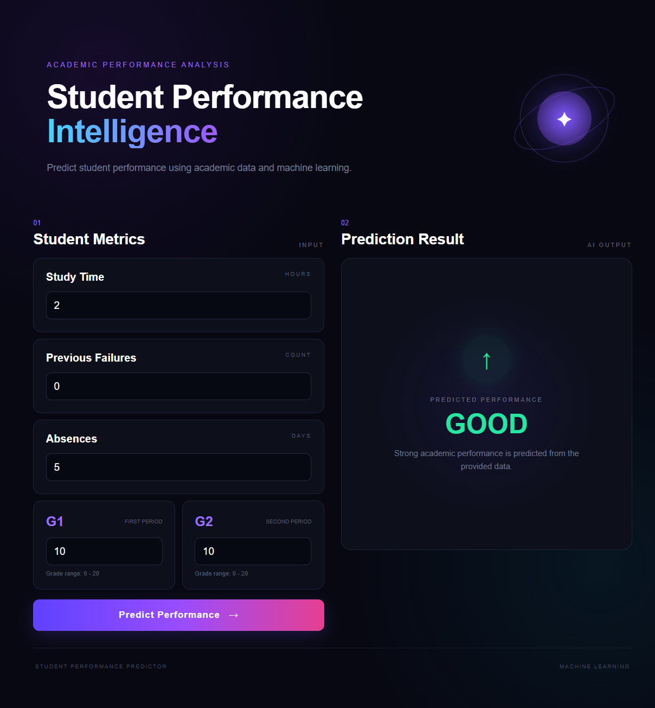

# 🎓 Student Performance Predictor

A Machine Learning web application that predicts a student's academic performance based on their academic information.

## 📸 Project Preview



## 🚀 Features

- 🎯 Predicts student performance
- 📊 Three performance classes:
  - Good
  - Average
  - Poor
- 🤖 Machine Learning classification model
- 🌐 Flask web application
- 🎨 Custom dark-themed UI
- ⚡ Real-time prediction

## 🧠 How It Works

```text
Student Information
        ↓
Machine Learning Model
        ↓
Performance Prediction
        ↓
Good / Average / Poor